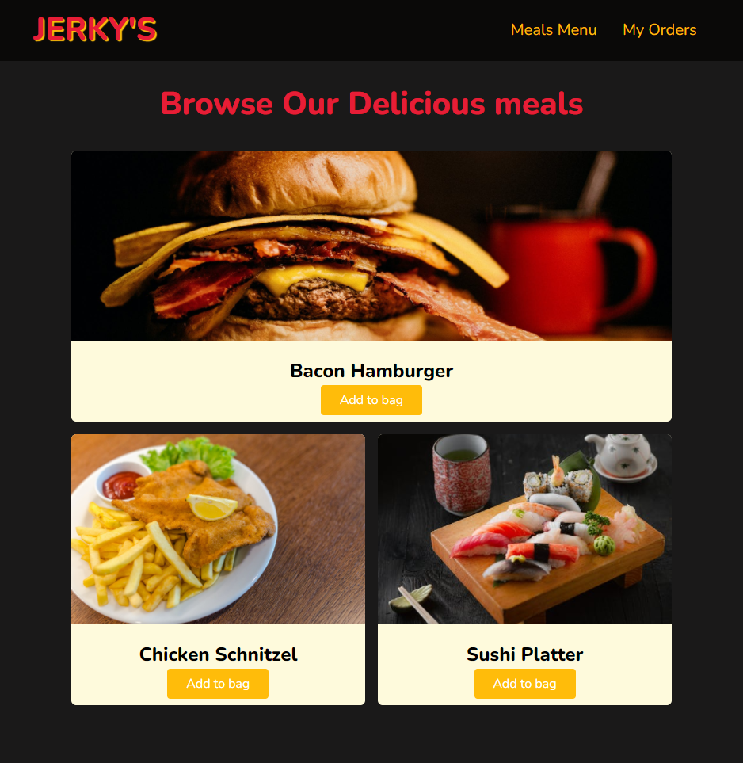
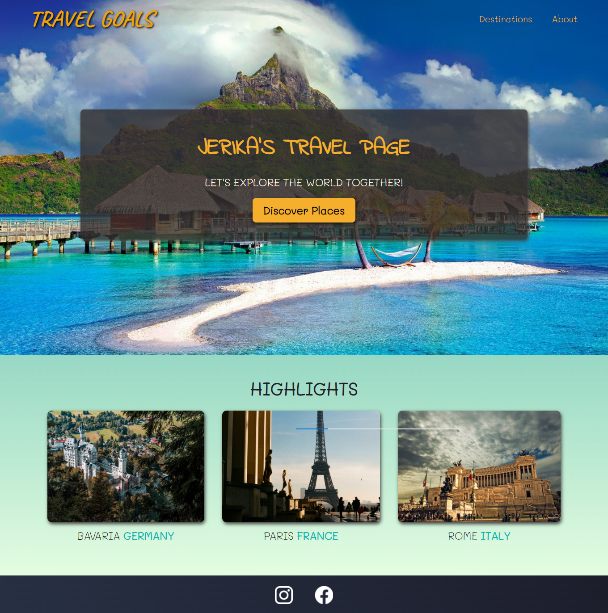
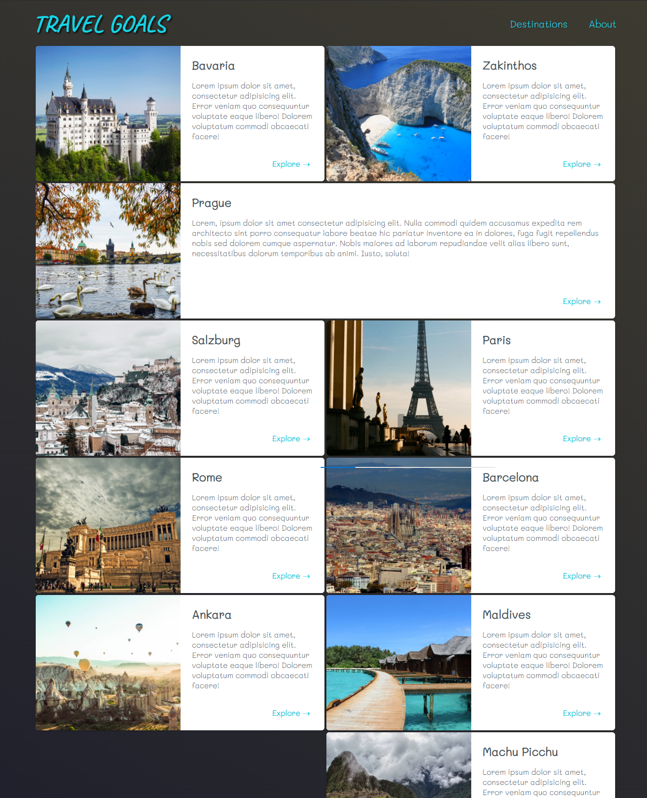
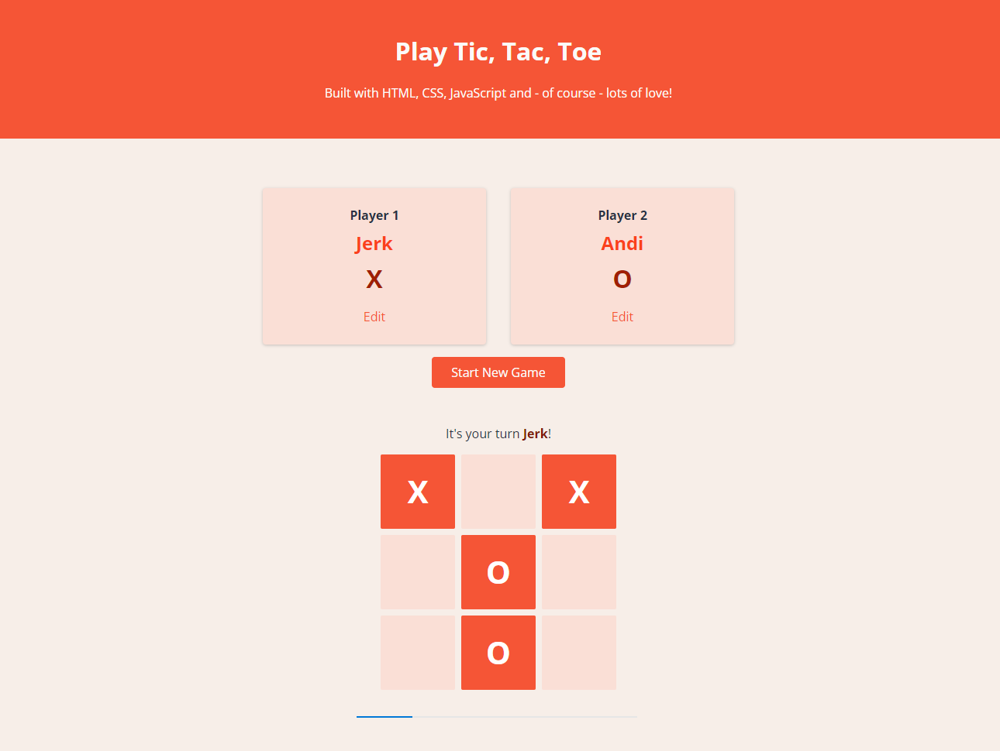

## Hi there I'm Jerika 👋

I'm from the Philippines but in 2019 I've moved to Germany where I now live.

🌱 I’m currently learning **Web Development** focusing on **React**.

<!-- Things that interest me are -->

<!-- I enjoy ... -->

So far, I've completed HTML, CSS and JavaScript courses in freeCodeCamp and Academind and have built a number of nice projects, a selection of which you can see below:

  
  
  
  
  
  
    

**I'm currently looking 👀 for an entry level position in Software/Web Development, remote or hybrid.**

Add me on LinkedIn <https://www.linkedin.com/in/jekanz/>

Next up 👇:

- [ ] Angular 
- [ ] NestJS
- [ ] Java

Completed ✔️:

## CSS
- [x] CSS 3
- [x] Bootstrap
- [x] Sass/ Scss 
- [x] Tailwind CSS ✨
- [x] Daisy UI ✨
- [x] Styled-Components

## JavaScript
- [x] Basic JavaScript
- [x] ES6
- [x] Regular Expressions
- [x] Debugging
- [x] Object Oriented Programming
- [x] Algorithm Scripting
- [x] ChartJS
- [x] React useState and useEffect ✨
- [x] Ionic Framework
- [x] Basic Typescript
- [x] NextJS

## Backend
- [x] Basic Python
- [x] MongoDB
- [x] NodeJS

## Other Tools
- [x] Basic Figma

